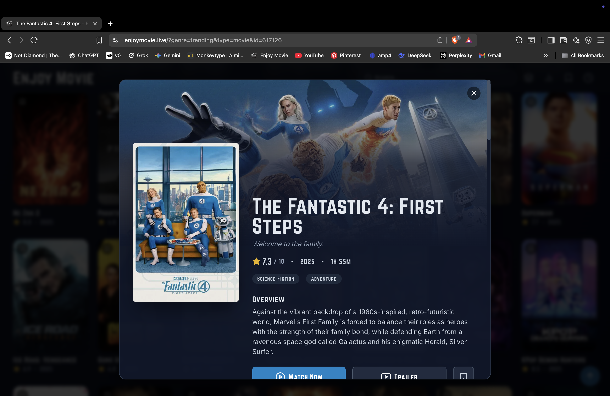
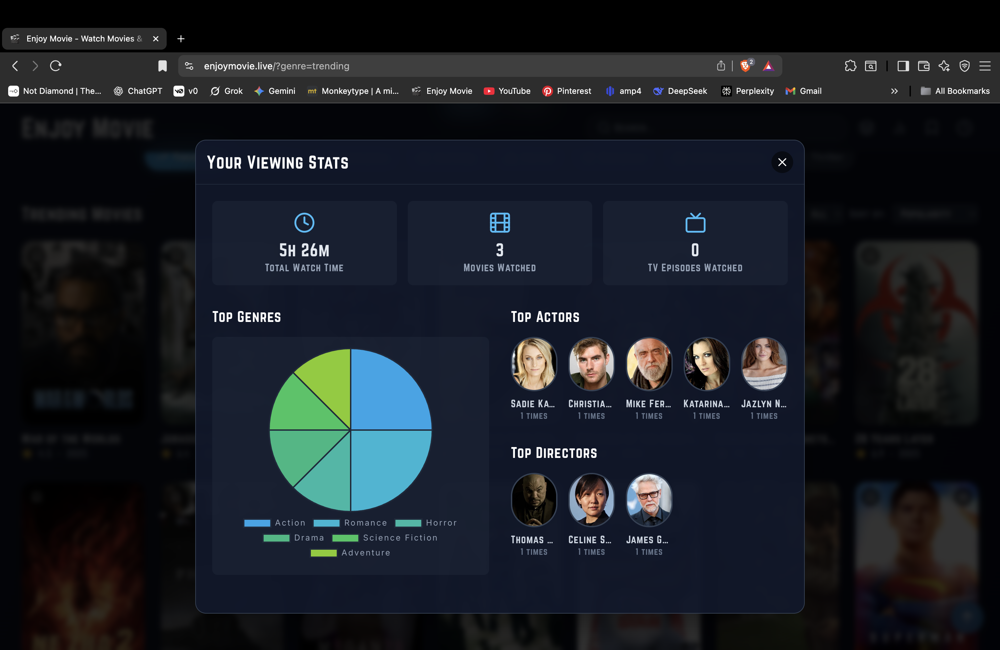

# 🎬 Enjoy Movie

**Enjoy Movie** is a feature-rich, single-page web application for browsing and streaming movies and TV shows. It's designed to be a sleek, modern, and user-friendly portal for media discovery, built entirely with vanilla JavaScript and the TMDB API.

---

### ✨ Core Features

Enjoy Movie offers a complete, personalized media browsing experience without requiring a user account.

* **Dynamic Discovery:**
    * **Trending Showcase:** A beautiful, interactive hero section displays the latest trending movies and shows.
    * **Advanced Filtering:** Easily switch between movies and TV shows. Refine your search by **genre**, **release year**, and **minimum rating**.
    * **Instant Search:** A live search bar with an autocomplete dropdown helps you find any title in seconds.

* **Personalization (No Account Needed!):**
    * **Watchlist:** 🔖 Save titles you want to watch later with a single click.
    * **Watch History:** 🕓 Automatically keeps a log of everything you've watched, so you never lose your place.
    * **Viewing Stats:** 📊 Dive deep into your viewing habits with a personal dashboard. See your total watch time, discover your most-watched genres in a pie chart, and find out which actors and directors you see the most.
    * **Custom Collections:** 📚 Become a curator by creating your own themed lists (e.g., "Favorite 90s Action Flicks"). You can then generate a unique link to **share your collections** with friends!

* **Seamless Viewing:**
    * **Multiple Servers:** Provides several streaming server options to ensure reliability.
    * **Detailed Modals:** Get all the information you need—plot summaries, cast, ratings, and recommendations—in a clean, pop-up modal.
    * **Trailer Access:** Watch trailers directly within the app.

---

### 📸 Screenshots

*The main browsing interface.*

*Detailed view of a specific movie.*

*The personalized user statistics dashboard.*

---

### Disclaimer

Enjoy Movie does not host any content on its own servers. It acts as a client-side interface that fetches data from the TMDB API and displays embedded video content from third-party sources. This project was created for educational and portfolio purposes.
